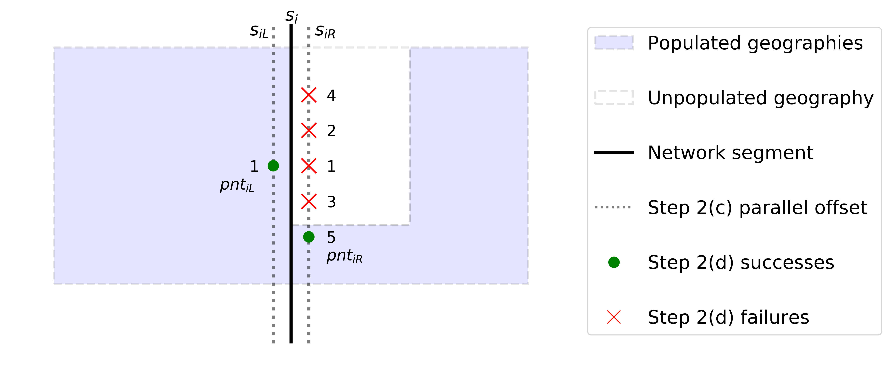

# Populated Polygons to Networks — *pp2n*
[](https://zenodo.org/badge/latestdoi/244989283) [](https://img.shields.io/github/v/tag/jGaboardi/pp2n?include_prereleases&logo=GitHub)
[](https://opensource.org/licenses/BSD-3-Clause)
[](https://www.python.org/)


Originally developed as the foundational method of Gaboardi (2019).

 * **Gaboardi, J. D.** (2019). *Populated Polygons to Networks: A Population-Centric Approach to Spatial
Network Allocation*. Ph. D. dissertation, Florida State University. Available at [FSU DigiNole](http://fsu.digital.flvc.org/islandora/object/fsu%3A722525).


## What is the *pp2n* method?

The *pp2n* is an original solution for allocating populations onto networks that is higher resolution than traditional methods and less computationaly complex than state-of-the-art methods (Gaboardi, 2019).

**... maybe pseudo algorithm here?...**

<p align="center">

</p>


**See also:** [jGaboardi/jGaboardi_dissertation](https://github.com/jGaboardi/jGaboardi_dissertation), [jGaboardi/tigernet](https://github.com/jGaboardi/tigernet), and [pysal/spaghetti](https://github.com/pysal/spaghetti)


## Examples


## Installation 


## BibTeX Citations
```
@software{jGaboardi:pp2n:2020,
  author    = {Gaboardi, James David},
  title     = {{jGaboardi/pp2n}},
  month     = mar,
  year      = 2020,
  publisher = {Zenodo},
  doi       = {10.5281/zenodo.3697225},
  url       = {https://doi.org/10.5281/zenodo.3697225}
}

@phdthesis{Gaboardi:dissertation:2019b,
  author    = {Gaboardi, James David},
  school    = {Florida State University},
  title     = {{Populated Polygons to Networks: 
                A Population-Centric Approach to Spatial Network Allocation
              }},
  note      = {Available at
               \href{http://fsu.digital.flvc.org/islandora/object/fsu%3A722525}{FSU DigiNole}
              },
  year      = {2019}
}
```

## License
The package is licensed under the [BSD license](https://github.com/jGaboardi/pp2n/blob/master/LICENSE).

## Funding
This project is/was partially funded through:

[](https://atlantardc.wordpress.com) Atlanta Research Data Center: [A Polygon-Based Approach to Spatial Network Allocation](https://atlantardc.files.wordpress.com/2018/05/ardc-newsletter_2018_2.pdf)

[](https://www.nsf.gov/index.jsp) National Science Foundation Award #1825768: [National Historical Geographic Information System](https://www.nsf.gov/awardsearch/showAward?AWD_ID=1825768&HistoricalAwards=false)

 
